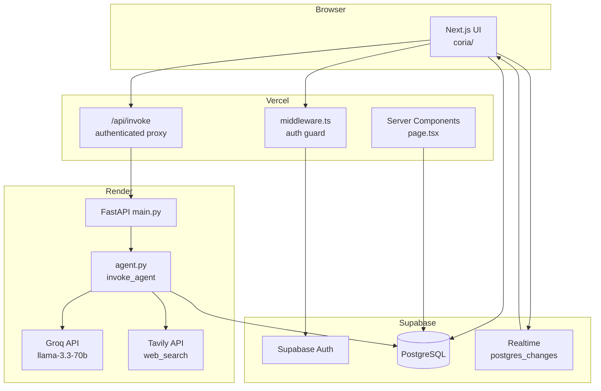

# Coria MVP — How It Works

> Architecture reference for the current shipped MVP (not the full product vision in `ARCHITECTURE.md`).

---

## Repo layout

```
coria/                          ← monorepo root (GitHub)
├── coria/                      ← Next.js frontend (Vercel root dir)
│   ├── app/                    ← pages, API routes, auth callback
│   ├── components/             ← chat UI
│   ├── lib/                    ← Supabase clients, utils
│   └── middleware.ts           ← auth guard (Edge)
├── backend/                    ← FastAPI agent service (Render)
│   ├── main.py                 ← HTTP API
│   ├── agent.py                ← LLM loop + trace + reply
│   ├── tools.py                ← web_search (Tavily)
│   └── prompts.py              ← Aria system prompt
└── render.yaml                 ← Render deploy config (repo root)
```

Three deployed services:

| Service | Host | Role |
|---------|------|------|
| **Frontend** | Vercel | UI, auth, realtime chat, proxy to backend |
| **Backend** | Render | AI agent runtime (Groq + tools) |
| **Database** | Supabase | Postgres, auth, realtime WebSockets |

---

## High-level architecture



---

## User flows

### 1. Sign in

```
/login → Supabase email+password
       → session cookie set
       → middleware.ts checks user on every request
       → unauthenticated users redirected to /login
```

**Tech:** Supabase Auth, `@supabase/ssr`, Edge middleware on Vercel.

---

### 2. Send a normal message

```
User types message → MessageInput.tsx
                   → supabase.from("messages").insert(...)
                   → row in PostgreSQL
                   → Supabase Realtime broadcasts INSERT
                   → Chat.tsx subscription receives it
                   → MessageList re-renders
```

Human messages go **directly to Supabase** from the browser. The backend is not involved.

**Tech:** `@supabase/supabase-js` (browser client), Supabase Realtime.

---

### 3. Ask Aria (`@aria ...`)

```
User: "@aria what's new in AI?"
        │
        ▼
MessageInput.tsx
  1. Insert human message to Supabase
  2. POST /api/invoke { user_message: "what's new in AI?" }
  3. Show "Aria is thinking…" indicator
        │
        ▼
coria/app/api/invoke/route.ts (Vercel server)
  - Verify user is logged in (Supabase session)
  - Forward to Render with INVOKE_SECRET header
        │
        ▼
backend/main.py  POST /invoke
  - Verify INVOKE_SECRET
  - Queue invoke_agent() as background task
  - Return { status: "accepted" } immediately
        │
        ▼
backend/agent.py  invoke_agent()
  1. Create reasoning_traces row (status: "running")
  2. Fetch last 10 messages → build system prompt
  3. Call Groq in agentic loop (optional web_search via Tavily)
  4. Update reasoning_traces with steps
  5. Insert agent message into messages table
        │
        ▼
Supabase Realtime → browser shows Aria's reply
```

---

## How AI is used

### The agent: Aria

- **Hardcoded** — not a DB entity. Always `sender_name: "Aria"`, `sender_type: "agent"`.
- **Trigger:** only `@aria <message>` (regex in `MessageInput.tsx`).
- No subscription, cron, workflow, or agent-to-agent triggers.

### LLM provider

| Env | Default |
|-----|---------|
| `LLM_PROVIDER` | `groq` |
| `LLM_MODEL` | `llama-3.3-70b-versatile` |

`agent.py` supports Groq (default, free) and Anthropic (optional, paid). Both share tool definitions from `tools.py`.

### System prompt

`backend/prompts.py` — Aria personality + instruction to use `web_search` when channel history is not enough.

### Context (not RAG)

Before calling the LLM, backend loads **last 10 channel messages** and injects them into the system prompt. No embeddings, no pgvector.

```python
fetch_recent_messages(supabase, limit=10)
build_system_prompt(recent_messages)
```

### Tool calling (agentic loop)

```
LLM request
    │
    ├─ no tool call → return text reply (done)
    │
    └─ tool_call: web_search
           → Tavily API → results back to LLM
           → final answer (max 5 loop iterations)
```

**One tool:** `web_search` via Tavily (`backend/tools.py`).

Trace steps: `tool_call_proposed` → `tool_result` → `reply`.

### Reasoning traces

Table `reasoning_traces` — JSON `steps` array. UI loads on **Show reasoning** click (`ReasoningTrace.tsx`).

### What AI does not do yet

- No streaming (batch reply then DB insert)
- No LangGraph
- No human approval before tools
- No per-agent permissions or budgets
- No vector memory / RAG
- No multi-agent

---

## Technology map

### Frontend (`coria/`)

| Tech | Purpose |
|------|---------|
| Next.js 16 (App Router) | SSR, API routes, pages |
| React 19 + Tailwind + shadcn | UI |
| `@supabase/ssr` | Auth on server / Edge |
| `@supabase/supabase-js` | Browser DB + Realtime |

| File | Job |
|------|-----|
| `middleware.ts` | Protect routes, refresh session |
| `app/page.tsx` | SSR messages, render Chat |
| `app/api/invoke/route.ts` | Auth'd proxy to FastAPI |
| `components/Chat.tsx` | Realtime + layout |
| `components/MessageInput.tsx` | Send, `@aria`, invoke |

### Backend (`backend/`)

| Tech | Purpose |
|------|---------|
| FastAPI | HTTP API, background tasks |
| Groq SDK | Free LLM + function calling |
| Anthropic SDK | Optional LLM |
| httpx | Tavily HTTP |
| supabase-py | DB writes (service role) |
| uvicorn | ASGI on Render |

### Supabase

| Feature | Used for |
|---------|----------|
| PostgreSQL | `messages`, `reasoning_traces` |
| Auth | Email/password |
| Realtime | Live INSERT → UI |

| Client | Key | Used by |
|--------|-----|---------|
| Anon | public | Browser, Next.js |
| Service role | secret | Backend only |

### External AI APIs

| API | Cost | Purpose |
|-----|------|---------|
| Groq | Free tier | LLM |
| Tavily | Free tier | Web search |
| Anthropic | Paid (optional) | Alt LLM |

---

## Data model (MVP)

### `messages`

```
id, sender_name, sender_type (human|agent), content,
reasoning_trace_id, action_block_id, created_at
```

### `reasoning_traces`

```
id, status (running|done|failed), steps (JSON), created_at
```

**Not in DB yet:** workspaces, channels, agents, members, audit logs, memory, tool registrations.

---

## Security (MVP)

```
Browser ──(anon key + session)──► Supabase (RLS)
Browser ──(session)──► /api/invoke (must be logged in)
Vercel ──(INVOKE_SECRET)──► Render /invoke
Render ──(service role)──► Supabase (agent writes)
```

Browser never calls Render directly.

---

## Deploy

```
Vercel (coria/)     Render (backend/)     Supabase
     │                    │                    │
     └────────────────────┴────────────────────┘
```

See `DEPLOY.md` for env vars and setup.

| Vercel | Render |
|--------|--------|
| `NEXT_PUBLIC_SUPABASE_*` | `SUPABASE_*`, `GROQ_API_KEY`, `TAVILY_API_KEY` |
| `BACKEND_URL` | `INVOKE_SECRET`, `CORS_ORIGINS` |
| `INVOKE_SECRET` | |

---

## Mental model

1. **Chat layer** — Supabase realtime; no backend for human messages
2. **Agent layer** — FastAPI + Groq; runs only on `@aria`
3. **Transparency** — reasoning traces in UI
4. **Tools** — Tavily web search

AI is not on every request — only `@mention` → background job → reply via Realtime.

---

## MVP vs full architecture

| Built | Not built |
|-------|-----------|
| Single `#general` channel | Workspaces, multi-channel |
| Hardcoded Aria | Agent entity, scopes, budgets |
| `@mention` trigger | Cron, subscription, workflow |
| Last-10 message context | pgvector RAG, memory tiers |
| Tavily web search | Tool broker, approvals, ABAC |
| Reasoning trace UI | Audit UI, kill switches |
| Groq (free) | LangGraph, MCP, streaming |

Full vision: see `ARCHITECTURE.md` (if present in product repo).
