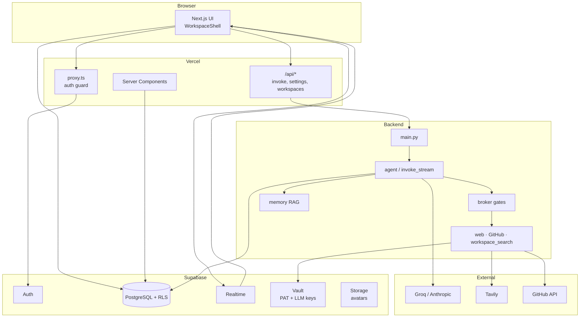

# Coria — Architecture (as-built)

System overview for the shipped V3 codebase. Product scope and user stories: [PRD-V3.md](./PRD-V3.md). Local setup: [README.md](./README.md).

**Tagline:** *Agents that act — with your team's permission.*

---

## Repo layout

```
coria-app/
├── coria/                          # Next.js 16 frontend (Vercel root)
│   ├── app/
│   │   ├── (app)/                  # Chat + settings (shared WorkspaceShell)
│   │   ├── api/                    # Auth'd proxies + workspace CRUD
│   │   ├── auth/                   # callback, confirm, join
│   │   ├── login/, onboarding/
│   ├── components/                 # Chat, settings, shell, UI primitives
│   ├── lib/                        # Supabase clients, workspace, stream-invoke
│   └── proxy.ts                    # Session refresh + route guard (middleware)
├── backend/                        # FastAPI agent service
│   ├── main.py                     # HTTP API
│   ├── agent.py / invoke_stream.py # Agentic loop (batch + SSE)
│   ├── broker/                     # Tool gates + audit
│   ├── action_blocks.py            # Approval pause / resume
│   ├── tools.py                    # Tool registry
│   ├── memory/                     # Embed + RAG retrieve
│   ├── integrations/               # GitHub PAT, Vault
│   ├── triggers/                   # Cron + keyword runners
│   └── supabase/migrations/        # Canonical DB schema
├── PRD-V3.md
├── README.md
└── ROADMAP.md
```

---

## Deployed services


| Service      | Host                | Role                                                 |
| ------------ | ------------------- | ---------------------------------------------------- |
| **Frontend** | Vercel (`coria/`)   | UI, auth, Realtime chat, API proxy to backend        |
| **Backend**  | Render (`backend/`) | Agent runtime, broker, triggers, admin APIs          |
| **Database** | Supabase            | Postgres, Auth, Realtime, Storage (`avatars`), Vault |


The browser **never** calls the FastAPI service directly. Next.js API routes forward requests with `INVOKE_SECRET`.

---

## High-level architecture




---

## Frontend shell

`coria/app/(app)/layout.tsx` wraps chat and settings in `**WorkspaceShell**`:

- **Sidebar** stays mounted across `/` and `/settings/`* (no full-page reload).
- **Channel routing:** `/?channel=<slug>` with `sessionStorage` + `popstate` fallback.
- **Settings:** `/settings/[section]` — workspace, profile, agents, members, integrations, triggers, audit.
- **Workspace switcher** + active workspace cookie (`POST /api/workspaces/active`).

Default agent per workspace: **@divv** only. Admins add specialized agents in **Settings → Agents** (e.g. research with `workspace_search`, engineering with GitHub write tools).

---

## Request paths

### Human message (no backend)

```
MessageInput → supabase.from("messages").insert(...)
            → Realtime INSERT → Chat.tsx → MessageList
            → POST /api/memory/embed (background)
            → POST /api/triggers/keyword (background, human messages only)
```

### Agent invoke (streaming)

```
@mention in MessageInput
  → POST /api/invoke/stream { user_message, channel_id, agent_id, thread_id? }
  → backend POST /invoke/stream (SSE)
  → token / status / action_block events
  → final message row in messages (+ reasoning_traces)
  → Realtime may also deliver the persisted row
```

Legacy `POST /api/invoke` → `POST /invoke` (background task, non-streaming) still exists; the UI uses streaming.

### Tool approval

```
LLM proposes gated tool → broker Gate 4 → action_blocks (pending)
  → SSE: action_block + awaiting_approval
  → User Approve/Decline in ActionBlock UI
  → POST /api/action-blocks/:id/decide
  → backend resumes invoke_stream with stored conversation_state
  → tool executes or agent acknowledges decline
```

### Settings / admin

Next.js routes under `coria/app/api/settings/*` authenticate the user, then proxy to FastAPI (`backend-proxy.ts` + `INVOKE_SECRET`). Workspace/member/channel mutations that touch RLS use the Supabase server client directly where appropriate.

---

## Agent runtime (`backend/`)

### Invoke checks

1. `workspace_settings.agents_globally_paused === false`
2. Agent `status === active`
3. Channel type + agent `channel_scope` (if set)
4. Invoker is workspace member

### Context assembly (order)

1. Thread messages (if `thread_id`)
2. Channel RAG — Pinecone index, `memory_tier=channel`, filtered by `channel_id`
3. Workspace RAG — if `agents.use_workspace_memory` (Pinecone, `memory_tier=workspace`)
4. Recent channel messages fallback

Embeddings: fastembed (`BAAI/bge-small-en-v1.5`, 384d), written on send via `/memory/embed`. Vectors live in **Pinecone**; Postgres `memory_items` is the content/metadata catalog (no embedding column).

### LLM


| Source             | When                                                                           |
| ------------------ | ------------------------------------------------------------------------------ |
| Server env         | `LLM_PROVIDER`, `GROQ_API_KEY` / `ANTHROPIC_API_KEY`                           |
| Workspace override | `workspace_settings.llm_provider` + Vault-stored key (Settings → Integrations) |


`prompts.py` is a fallback default; per-agent `system_prompt` in DB takes precedence.

### Orchestration (`orchestration/`)

Agent tool loops run on a **LangGraph** `StateGraph` (`model → tools → model`, max 5 iterations):

```
backend/orchestration/
  graph.py    — compiled StateGraph
  nodes.py    — call_model, execute_tools
  stream.py   — SSE adapter (run_agent_graph_streaming)
```

- **Streaming path:** `invoke_stream.py` → `run_agent_graph_streaming` (Groq token stream; Anthropic via LangChain)
- **Legacy path:** `agent.invoke_agent` → `run_agent_graph` (graph.ainvoke)
- **Approval pause/resume:** Supabase `reasoning_traces.conversation_state.working` (OpenAI-style dicts); no LangGraph checkpointer
- **Tool execution:** still via `tool_runner.run_tool_with_broker` — not LangChain auto-tools

### Tools (`tools.py`)


| Tool                  | Approval default |
| --------------------- | ---------------- |
| `web_search`          | Auto (Tavily)    |
| `github_read`         | Auto             |
| `workspace_search`    | Auto             |
| `github_post_comment` | Required         |
| `github_create_pr`    | Required         |


### Tool broker (`broker/`)

Every tool call:

```
permission → budget → rate → approval (if policy) → audit → execute
```

Policies in `tool_policies`; outcomes in `audit_log`. Budget on `workspace_settings` (`monthly_tool_budget` / `tool_budget_used`).

### Triggers (`triggers/`)

- **Keyword** — fired from Next.js after human message insert; 30s debounce per trigger+channel.
- **Cron** — `POST /triggers/run-cron` (external scheduler or pg_cron); demo seeds exist for the bootstrap workspace.
- **Manual** — Settings → Triggers → Run now.

Respects kill switch, agent pause, and broker gates.

---

## Auth & team


| Flow                        | Route / mechanism                           |
| --------------------------- | ------------------------------------------- |
| Sign up / password sign-in  | `/login`                                    |
| Magic link (existing users) | `/login` → Supabase OTP → `/auth/callback`  |
| First workspace             | `/onboarding` → `create_workspace` RPC      |
| Email invite                | Admin invite → Supabase Auth → `/auth/join` |
| Roles                       | `owner`, `admin`, `member` on `members`     |


`proxy.ts` refreshes the session and redirects unauthenticated users away from protected routes.

---

## Data model (summary)

Core tables (see migrations in `backend/supabase/migrations/`):


| Domain       | Tables                                                                                  |
| ------------ | --------------------------------------------------------------------------------------- |
| Tenancy      | `workspaces`, `members`, `pending_invites`                                              |
| Chat         | `channels`, `messages` (threads, pins, `reply_count`)                                   |
| Agents       | `agents`, `agent_triggers`                                                              |
| Trust        | `workspace_settings`, `tool_policies`, `action_blocks`, `audit_log`, `reasoning_traces` |
| Memory       | Pinecone index + `memory_items` catalog (channel / workspace tiers)                     |
| Integrations | `integrations` (`github`, `llm` — secrets in Vault)                                     |


RLS on all tenant data. Service role used only on the backend for agent writes and admin paths that bypass RLS intentionally.

---

## Security model

```
Browser ──(anon key + session)──► Supabase RLS
Browser ──(session)───────────► Next.js /api/* (must be logged in)
Next.js ──(INVOKE_SECRET)─────► FastAPI /invoke, /agents, …
FastAPI ──(service role)──────► Supabase (agent messages, broker, memory)
Vault ──encrypted PAT/keys────► GitHub + per-workspace LLM keys
```

- Integration secrets never stored in plaintext in Postgres.
- Audit log stores hashed tool inputs, not raw tokens.
- `INVOKE_SECRET` optional locally if unset on both sides; recommended in production.

---

## Key frontend modules


| Module                 | Role                                         |
| ---------------------- | -------------------------------------------- |
| `WorkspaceShell.tsx`   | Persistent layout, channel slug bridge       |
| `Chat.tsx`             | Realtime, invoke stream, threads, pins, FTUE |
| `MessageInput.tsx`     | Send, `@mention` autocomplete, invoke        |
| `ActionBlock.tsx`      | Approve / decline + resume stream            |
| `SettingsPanel.tsx`    | Lazy-loaded settings sections                |
| `lib/stream-invoke.ts` | SSE client for `/api/invoke/stream`          |


---

## Key backend modules


| Module                   | Role                               |
| ------------------------ | ---------------------------------- |
| `invoke_stream.py`       | SSE agent loop, action-block pause |
| `action_blocks.py`       | Create / decide / resume           |
| `broker/gates.py`        | Five-gate evaluation               |
| `memory/retrieve.py`     | Channel + workspace RAG            |
| `integrations/github.py` | Read / comment / PR                |
| `integrations/vault.py`  | Supabase Vault read/write          |
| `agents_admin.py`        | CRUD + workspace settings patch    |
| `members_admin.py`       | Profile, invites, roles            |


---

## Deploy


| Target   | Root / config                    |
| -------- | -------------------------------- |
| Frontend | Vercel, root `coria`             |
| Backend  | `backend/render.yaml`            |
| Database | `cd backend && supabase db push` |


Env vars: [README.md § Environment variables](./README.md#environment-variables). Supabase Auth redirect URLs: `/auth/callback`, `/auth/confirm`, `/auth/join` per origin.

---

## Mental model

1. **Chat layer** — Supabase Realtime; humans write directly to Postgres.
2. **Agent layer** — FastAPI on `@mention`, triggers, or approval resume; streams tokens over SSE.
3. **Trust layer** — Broker + action blocks before external writes.
4. **Memory layer** — Embeddings on send; RAG at invoke time.
5. **Admin layer** — Settings UI + FastAPI admin routes; invites via Supabase Auth.

---

## Deferred / not in UI (see PRD §14)

- Agent-to-agent `@mention` chaining
- `use_workspace_memory` and `channel_scope` toggles in agent form
- `default_channel_id` workspace setting
- Automatic in-app cron scheduler (use external ping to `/triggers/run-cron`)

Full gap list: [PRD-V3.md §14](./PRD-V3.md#14-open-questions--known-gaps).

---

*Last aligned with codebase: 2026-06-06.*