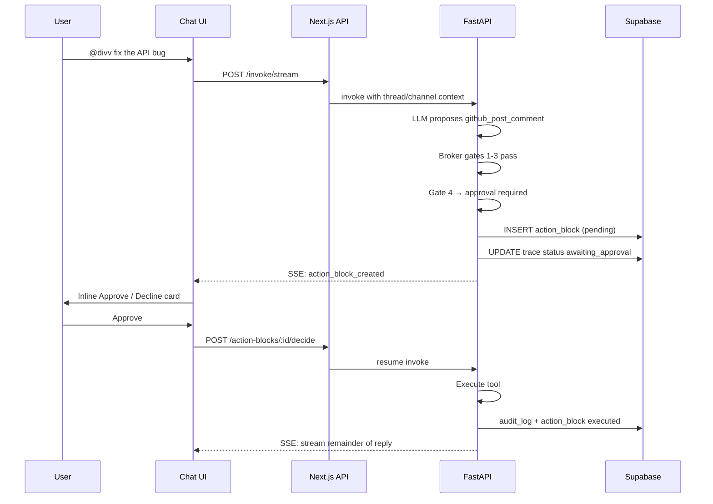
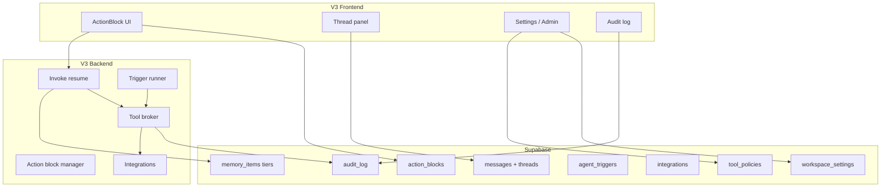

# Coria V3 — Product Requirements Document

**Status:** Shipped (as-built sync)  
**Author:** Coria team  
**Last updated:** 2026-06-06 (v0.5)  
**Depends on:** V1 (MVP) + V2 (teams, RAG, streaming) — shipped  
**Aligns with:** `ARCHITECTURE.md` + product vision

---

## 1. Summary

V1 proved the chat loop. V2 added structure (workspaces, channels, agents in DB), memory (RAG), and streaming. V3 makes Coria a **trustworthy AI-native team platform**: humans stay in control of risky actions, multiple specialized agents collaborate, tools are governed, and memory spans the whole workspace.

**V3 tagline:** *Agents that act — with your team's permission.*

V3 is intentionally **feature-rich**. V1–V2 were foundation; V3 is the first release where Coria feels like a product teams could run daily, not a demo.

**As-built note (v0.5):** Milestones M1–M5 are implemented in `coria-app`. This document now reflects what is **actually shipped**, including features added during implementation that were not in the original PRD (theme, persistent shell, channel settings, per-workspace LLM, etc.). See [§18 Implementation status](#18-implementation-status-as-built) and [§14 Known gaps](#14-open-questions--known-gaps).

---

## 2. Problem statement

### V2 limitations


| Limitation                 | User impact                                     |
| -------------------------- | ----------------------------------------------- |
| Single agent (Divv)        | Can't specialize roles (research vs eng vs PM)  |
| Tools run without approval | Team can't gate GitHub writes or spend          |
| No audit trail UI          | Can't answer "what did the agent do last week?" |
| Channel-only memory        | Cross-channel decisions invisible to agent      |
| No agent admin UI          | Pause, scope, prompt changes require SQL        |
| Read-only GitHub only      | Agent can't draft PRs or comments               |
| No proactive agents        | Agent only responds to `@mention`               |
| Flat member model          | No admin vs member; no invites                  |
| No threads                 | Long channel history hard to follow             |
| Reasoning trace incomplete | Tool steps not surfaced in UI                   |


### What users need next

1. **Trust** — approve before agents take external actions
2. **Specialization** — multiple agents with distinct personas and tool sets
3. **Governance** — budgets, rate limits, audit log, kill switches
4. **Breadth** — workspace memory, threads, integrations beyond GitHub read
5. **Control** — admin settings, agent config UI, member invites
6. **Proactivity** — scheduled digests, keyword triggers, agent-to-agent handoffs

---

## 3. Goals


| #   | Goal                        | Success looks like                                                   |
| --- | --------------------------- | -------------------------------------------------------------------- |
| G1  | Human-in-the-loop actions   | Sensitive tool calls pause for Approve / Decline in chat             |
| G2  | Tool broker (5 gates)       | Every tool call passes permission → budget → rate → approval → audit |
| G3  | Multi-agent workspace       | Admin creates 2+ agents; user `@mention`s any active agent in scope  |
| G4  | Agent admin & kill switches | Owner pauses agent or halts all agents from UI                       |
| G5  | Workspace memory tier       | Agent retrieves relevant context across channels                     |
| G6  | Write-capable integrations  | GitHub comment/PR draft                                              |
| G7  | Audit & transparency        | Filterable audit log; full reasoning trace with tool steps           |
| G8  | Team admin                  | Invite members, assign roles, workspace settings                     |
| G9  | Member profiles             | Any role edits own display name, avatar, bio                         |
| G10 | Threads & organization      | Reply in thread; agent respects thread context                       |
| G11 | Proactive agents (MVP)      | Scheduled channel digest + keyword trigger                           |
| G12 | Stay near ₹0–500 infra      | Free tiers + documented paid escape hatches                          |


---

## 4. Non-goals (V3)

Explicitly **out of scope** — target V4+:

- SSO, SCIM, SAML enterprise auth
- Full LangGraph / MCP server registration UI
- Knowledge graph adjacency table
- Mobile native apps
- Voice / video
- Billing & Stripe (usage metering UI only, no payments)
- Custom LLM fine-tuning
- SOC2 / HIPAA compliance packages
- Unlimited third-party integrations (Slack bridge, Linear, Notion, etc.)
- Agent marketplace / public agent templates

---

## 5. User personas

### P1 — Team member (primary)

Daily chat user. `@divv` for general chat and summaries; additional agents (e.g. research or engineering) created by admins. Expects approval prompts when an agent wants to post a GitHub comment. Uses threads for focused discussions.

### P2 — Workspace owner / admin (primary)

Sets up Coria for a team. Creates agents, assigns tool permissions, sets monthly tool budgets, invites members, reviews audit log after incidents.

### P3 — Builder / demo host (secondary)

Runs Coria for portfolio or OSS demo. Needs polished admin UI, documented migrations, and a compelling multi-agent story.

### P4 — Approver (secondary)

Not always the invoker. Gets notified when an agent action block awaits decision. Approves or declines from inline chat UI or notifications panel.

---

## 6. User stories

### Action blocks & approvals


| ID   | Story                                                                                                                                | Priority |
| ---- | ------------------------------------------------------------------------------------------------------------------------------------ | -------- |
| US-1 | As a user, when an agent proposes a sensitive action I see an inline **Action Block** with summary, tool name, and Approve / Decline | P0       |
| US-2 | As a user, declining an action shows agent acknowledgment without executing the tool                                                 | P0       |
| US-3 | As a user, approving an action resumes the agent loop and executes the tool                                                          | P0       |
| US-4 | As a user, I see action block status: `pending`, `approved`, `declined`, `expired`                                                   | P0       |
| US-5 | As a system, action blocks expire after configurable TTL (default 24h)                                                               | P1       |
| US-6 | As any workspace member (owner, admin, or member), I can approve/decline an action block even if I didn't invoke the agent           | P0       |
| US-7 | As a user, reasoning trace shows `tool_call_proposed`, `approval_requested`, `approval_decision`, `tool_result` steps                | P0       |


### Tool broker


| ID    | Story                                                                                               | Priority |
| ----- | --------------------------------------------------------------------------------------------------- | -------- |
| US-8  | As a system, every tool call runs through broker gates before execution                             | P0       |
| US-9  | As an admin, I configure which tools require approval vs auto-run                                   | P0       |
| US-10 | As an admin, I set per-workspace monthly tool budget (e.g. 100 calls)                               | P1       |
| US-11 | As a system, budget exhaustion blocks further gated tools with clear error                          | P1       |
| US-12 | As a system, rate limit per agent (e.g. 10 tool calls / minute)                                     | P1       |
| US-13 | As a system, permission gate checks agent `allowed_tools` + member role                             | P0       |
| US-14 | As an admin, I view audit log entries for every tool attempt (allowed, blocked, approved, declined) | P0       |


### Multi-agent


| ID    | Story                                                                                      | Priority |
| ----- | ------------------------------------------------------------------------------------------ | -------- |
| US-15 | As a user, I `@mention` any active agent by slug (e.g. `@divv` or admin-created agents)    | P0       |
| US-16 | As an admin, I create a new agent (name, slug, model, system prompt, tools, channel scope) | P0       |
| US-17 | As an admin, I edit agent config from settings UI                                          | P0       |
| US-18 | As an admin, I pause / resume an individual agent                                          | P0       |
| US-19 | As a user, `@mention` autocomplete lists all active agents in scope for current channel    | P0       |
| US-20 | As a system, paused agents return friendly "agent paused" message on invoke                | P0       |
| US-21 | As an admin, I use agent templates (Research, Engineering, PM) when creating agents        | P2       |


**Default agent (seeded per workspace):**


| Agent | Slug   | Focus                                    | Default tools           |
| ----- | ------ | ---------------------------------------- | ----------------------- |
| Divv  | `divv` | General teammate (**workspace default**) | web_search, github_read |


New workspaces get **only `@divv`**. Admins create additional agents in **Settings → Agents** — for example a research agent with `workspace_search`, or an engineering agent with `github_post_comment` and `github_create_pr`.

**Agent templates (US-21, P2):** not implemented — create agents manually in settings UI.

### Agent admin & kill switches


| ID    | Story                                                                         | Priority |
| ----- | ----------------------------------------------------------------------------- | -------- |
| US-22 | As an admin, I hit **Pause all agents** at workspace level (kill switch)      | P0       |
| US-23 | As a user, kill switch shows banner in chat; invokes blocked with explanation | P0       |
| US-24 | As an admin, I re-enable agents from workspace settings                       | P0       |
| US-25 | As an admin, I see agent status (active/paused) in sidebar or settings        | P1       |


### Memory tiers


| ID    | Story                                                                                          | Priority |
| ----- | ---------------------------------------------------------------------------------------------- | -------- |
| US-26 | As a system, channel memory (V2 RAG) continues to work                                         | P0       |
| US-27 | As a system, workspace memory retrieves top-k chunks across all channels user/agent can access | P0       |
| US-28 | As an admin, I enable/disable workspace memory per agent                                       | P1       |
| US-29 | As a user, agent cites which channel a workspace memory chunk came from                        | P1       |
| US-30 | As a system, thread messages embed into memory with `thread_id` metadata                       | P1       |


### Integrations & tools


| ID    | Story                                                                                         | Priority |
| ----- | --------------------------------------------------------------------------------------------- | -------- |
| US-31 | As an admin, I connect GitHub via PAT (stored encrypted) at workspace level                   | P0       |
| US-32 | As a user, an agent with `github_read` can read private repos when PAT has access             | P1       |
| US-33 | As a user, an agent with `github_post_comment` can draft an issue comment (approval required) | P0       |
| US-34 | As a user, an agent with `github_create_pr` can draft a PR (approval required)                | P1       |
| US-37 | As a system, `workspace_search` tool searches workspace memory (not web)                      | P0       |
| US-38 | As an admin, I register which integrations are available per workspace                        | P1       |


### Audit log


| ID    | Story                                                           | Priority |
| ----- | --------------------------------------------------------------- | -------- |
| US-39 | As an admin, I open Audit Log from workspace settings           | P0       |
| US-40 | As an admin, I filter audit by agent, tool, outcome, date range | P1       |
| US-41 | As an admin, I export audit log as JSON (last 30 days)          | P2       |
| US-42 | As a user, I click through from action block to its audit entry | P1       |


### Team & workspace admin


| ID    | Story                                                                                             | Priority |
| ----- | ------------------------------------------------------------------------------------------------- | -------- |
| US-43 | As an owner or admin, I invite a member by email via **Supabase Auth** (invite link / magic link) | P0       |
| US-44 | As an owner, I assign role: `owner`, `admin`, `member`                                            | P0       |
| US-45 | As an admin, I rename workspace and set default channel                                           | P1       |
| US-46 | As an admin, I configure workspace defaults (approval TTL, tool budget)                           | P1       |
| US-47 | As a member, I leave workspace                                                                    | P2       |
| US-48 | As an owner, I transfer ownership                                                                 | P2       |


### Member profile


| ID     | Story                                                                              | Priority |
| ------ | ---------------------------------------------------------------------------------- | -------- |
| US-49a | As any member (owner, admin, or member), I can edit my own profile                 | P0       |
| US-49b | As a user, I set display name, bio, and avatar via **file upload or optional URL** | P0       |
| US-49c | As a user, my display name and avatar appear on my messages across all channels    | P0       |
| US-49d | As a user, I open profile settings from header or sidebar                          | P1       |


### Threads


| ID    | Story                                                                      | Priority |
| ----- | -------------------------------------------------------------------------- | -------- |
| US-49 | As a user, I start a thread from any message                               | P0       |
| US-50 | As a user, I see thread reply count on parent message                      | P0       |
| US-51 | As a user, I open thread panel and reply without cluttering main channel   | P0       |
| US-52 | As a user, I `@mention` an agent inside a thread                           | P0       |
| US-53 | As a system, agent invoke in thread includes thread messages + channel RAG | P0       |


### Proactive agents


| ID    | Story                                                                                        | Priority |
| ----- | -------------------------------------------------------------------------------------------- | -------- |
| US-54 | As an admin, I schedule a daily channel digest (cron: post summary at 9am; defaults to Divv) | P1       |
| US-55 | As an admin, I add keyword trigger (e.g. when message contains `bug:` invoke an agent)       | P1       |
| US-56 | As a user, I see digest messages attributed to the agent                                     | P1       |
| US-57 | As an admin, I disable triggers per channel                                                  | P1       |


### Agent-to-agent (A2A) — deferred


| ID    | Story                                                                       | Priority | Status |
| ----- | --------------------------------------------------------------------------- | -------- | ------ |
| US-58 | As a system, an agent can `@mention` another agent in its reply to delegate | P2       | —      |
| US-59 | As a user, I see chained agent replies clearly attributed                   | P2       | —      |
| US-60 | As a system, A2A depth capped at 2 to prevent runaway loops                 | P0       | —      |


### UX & polish


| ID    | Story                                                               | Priority | Status |
| ----- | ------------------------------------------------------------------- | -------- | ------ |
| US-61 | As a user, I see pending approval count badge in header             | P1       | ✓      |
| US-62 | As a user, I get toast when someone else approves my agent's action | P1       | —      |
| US-63 | As a user, I search messages in current channel (text search)       | P1       | ✓      |
| US-64 | As a user, I pin up to 5 messages per channel                       | P2       | ✓      |
| US-65 | As a user, I see agent avatar and color per agent in message list   | P1       | ✓      |
| US-66 | As a user, mobile layout remains usable for approvals and threads   | P1       | ✓      |


### Auth & onboarding (shipped; added during build)


| ID    | Story                                                                                    | Priority | Status |
| ----- | ---------------------------------------------------------------------------------------- | -------- | ------ |
| US-67 | As a new user, I sign up with email + password and confirm via Supabase email            | P0       | ✓      |
| US-68 | As a returning user, I sign in with magic link (OTP email) or password                   | P0       | ✓      |
| US-69 | As an invitee, I accept a workspace invite via `/auth/join` after Auth email link        | P0       | ✓      |
| US-70 | As a first-time user without a workspace, I create one on `/onboarding` (self-serve RPC) | P0       | ✓      |


### Workspace & channel admin (shipped; added during build)


| ID    | Story                                                                                         | Priority | Status |
| ----- | --------------------------------------------------------------------------------------------- | -------- | ------ |
| US-71 | As a user, I switch between workspaces I belong to from the sidebar                           | P1       | ✓      |
| US-72 | As a user, I create a new workspace inline from the workspace switcher                        | P1       | ✓      |
| US-73 | As owner/admin, I delete a workspace with typed name confirmation                             | P1       | ✓      |
| US-74 | As a user, I create channels from the sidebar (default type: hybrid)                          | P0       | ✓      |
| US-75 | As owner/admin, I delete a channel (not the last channel in workspace)                        | P1       | ✓      |
| US-76 | As owner/admin, I edit channel name, description (280 chars), and type (hybrid / humans-only) | P1       | ✓      |
| US-77 | As a user, channel navigation uses `/?channel=<slug>` with browser back/forward support       | P1       | ✓      |


### Shell, theme & profiles (shipped; added during build)


| ID    | Story                                                                                             | Priority | Status |
| ----- | ------------------------------------------------------------------------------------------------- | -------- | ------ |
| US-78 | As a user, the sidebar stays mounted when I switch channels or open Settings (no full-page flash) | P1       | ✓      |
| US-79 | As a user, I choose light, dark, or system theme in **Settings → Profile → Appearance**           | P1       | ✓      |
| US-80 | As a user, I hover a sender avatar to see a profile card (member role/bio or agent status)        | P2       | ✓      |
| US-81 | As a user, human avatars are circular with first-letter fallback when no photo                    | P1       | ✓      |
| US-82 | As a user, I resize the desktop sidebar; width persists in localStorage                           | P2       | ✓      |
| US-83 | As a new member, I see a one-time FTUE modal explaining `@agent` mentions                         | P2       | ✓      |


### Messaging (shipped; added or clarified during build)


| ID    | Story                                                                      | Priority | Status |
| ----- | -------------------------------------------------------------------------- | -------- | ------ |
| US-84 | As a user, I delete only my own human messages (RLS-enforced)              | P1       | ✓      |
| US-85 | As a user, I open a **Pins** tab in the channel header for pinned messages | P2       | ✓      |
| US-86 | As a user, messages and action blocks update live via Supabase Realtime    | P0       | ✓      |
| US-87 | As a user, switching channels caches loaded messages for faster return     | P2       | ✓      |


### Per-workspace LLM (shipped; added during build)


| ID    | Story                                                                                                    | Priority | Status |
| ----- | -------------------------------------------------------------------------------------------------------- | -------- | ------ |
| US-88 | As owner/admin, I set workspace LLM provider (Groq / Anthropic) and model in **Settings → Integrations** | P1       | ✓      |
| US-89 | As owner/admin, I store a workspace API key in Supabase Vault (falls back to server env if unset)        | P1       | ✓      |


---

## 7. Functional requirements

### 7.1 Data model

New / updated Supabase tables and enums.

#### Enum updates

```sql
-- extend member_role
ALTER TYPE member_role ADD VALUE IF NOT EXISTS 'admin';

-- action block lifecycle
CREATE TYPE action_block_status AS ENUM (
  'pending', 'approved', 'declined', 'expired', 'executed', 'failed'
);

-- audit outcomes
CREATE TYPE audit_outcome AS ENUM (
  'allowed', 'blocked_permission', 'blocked_budget', 'blocked_rate',
  'pending_approval', 'approved', 'declined', 'executed', 'failed'
);

-- trigger types
CREATE TYPE agent_trigger_type AS ENUM ('cron', 'keyword');
```

#### `action_blocks`


| Column         | Type                       | Notes                      |
| -------------- | -------------------------- | -------------------------- |
| `id`           | uuid PK                    |                            |
| `workspace_id` | uuid FK                    |                            |
| `channel_id`   | uuid FK                    |                            |
| `thread_id`    | uuid FK nullable           |                            |
| `agent_id`     | uuid FK                    |                            |
| `trace_id`     | uuid FK → reasoning_traces | loop paused here           |
| `tool_name`    | text                       | e.g. `github_post_comment` |
| `tool_input`   | jsonb                      | redacted secrets           |
| `summary`      | text                       | human-readable one-liner   |
| `status`       | action_block_status        |                            |
| `requested_by` | uuid FK → members          | invoker                    |
| `decided_by`   | uuid FK → members nullable |                            |
| `expires_at`   | timestamptz                | default now + 24h          |
| `created_at`   | timestamptz                |                            |
| `decided_at`   | timestamptz nullable       |                            |


#### `audit_log`


| Column            | Type             | Notes                              |
| ----------------- | ---------------- | ---------------------------------- |
| `id`              | uuid PK          |                                    |
| `workspace_id`    | uuid FK          |                                    |
| `agent_id`        | uuid FK nullable |                                    |
| `member_id`       | uuid FK nullable | human actor                        |
| `action_block_id` | uuid FK nullable |                                    |
| `tool_name`       | text             |                                    |
| `tool_input_hash` | text             | SHA-256 of input (not raw secrets) |
| `outcome`         | audit_outcome    |                                    |
| `gate_failed`     | text nullable    | permission, budget, rate, approval |
| `metadata`        | jsonb            | duration_ms, error, channel_id     |
| `created_at`      | timestamptz      |                                    |


#### `workspace_settings`


| Column                     | Type             | Notes                                      |
| -------------------------- | ---------------- | ------------------------------------------ |
| `workspace_id`             | uuid PK FK       |                                            |
| `agents_globally_paused`   | boolean          | kill switch                                |
| `monthly_tool_budget`      | int              | default 500                                |
| `tool_budget_used`         | int              | reset monthly via cron                     |
| `approval_ttl_hours`       | int              | default 24                                 |
| `default_channel_id`       | uuid FK nullable |                                            |
| `default_agent_id`         | uuid FK → agents | Divv; used for digests, ambiguous triggers |
| `workspace_memory_enabled` | boolean          | default true                               |
| `llm_provider`             | text nullable    | `groq` | `anthropic`; null = server env    |
| `llm_model`                | text nullable    | model id for workspace override            |
| `updated_at`               | timestamptz      |                                            |


#### `channels` (extend V2)


| Column        | Type          | Notes                                    |
| ------------- | ------------- | ---------------------------------------- |
| `description` | text nullable | max 280 chars; shown in channel header   |
| `type`        | channel_type  | `hybrid` (agents allowed) | `human_only` |


Admin/owner may `UPDATE` name, description, type (slug derived from name on rename).

#### `tool_policies`


| Column                  | Type          | Notes                            |
| ----------------------- | ------------- | -------------------------------- |
| `id`                    | uuid PK       |                                  |
| `workspace_id`          | uuid FK       |                                  |
| `tool_name`             | text          |                                  |
| `requires_approval`     | boolean       |                                  |
| `allowed_roles`         | member_role[] | default `{owner, admin, member}` |
| `rate_limit_per_minute` | int nullable  | per agent                        |
| `enabled`               | boolean       |                                  |


#### `integrations`


| Column             | Type              | Notes                                                       |
| ------------------ | ----------------- | ----------------------------------------------------------- |
| `id`               | uuid PK           |                                                             |
| `workspace_id`     | uuid FK           |                                                             |
| `provider`         | text              | `github`, `llm`                                             |
| `config_encrypted` | text              | PAT encrypted via **Supabase Vault**; ciphertext only in DB |
| `status`           | enum              | `active`, `error`, `disconnected`                           |
| `created_by`       | uuid FK → members |                                                             |
| `created_at`       | timestamptz       |                                                             |


#### `agents` (extend V2)


| Column                 | Type          | Notes                                                  |
| ---------------------- | ------------- | ------------------------------------------------------ |
| `avatar_url`           | text nullable |                                                        |
| `color`                | text          | hex, UI accent                                         |
| `use_workspace_memory` | boolean       | default false; enable per agent for workspace-tier RAG |
| `template_id`          | text nullable | research, engineering, pm                              |
| `triggers_enabled`     | boolean       | default true                                           |


#### `agent_triggers`


| Column        | Type                 | Notes                     |
| ------------- | -------------------- | ------------------------- |
| `id`          | uuid PK              |                           |
| `agent_id`    | uuid FK              |                           |
| `channel_id`  | uuid FK              |                           |
| `type`        | agent_trigger_type   |                           |
| `config`      | jsonb                | cron expr or keyword list |
| `enabled`     | boolean              |                           |
| `last_run_at` | timestamptz nullable |                           |
| `created_at`  | timestamptz          |                           |


#### `messages` (extend V2)


| Column              | Type             | Notes            |
| ------------------- | ---------------- | ---------------- |
| `thread_id`         | uuid FK nullable | null = top-level |
| `parent_message_id` | uuid FK nullable | thread root      |
| `reply_count`       | int              | denormalized     |
| `is_pinned`         | boolean          | default false    |


#### `memory_items` (extend V2)


| Column        | Type          | Notes                  |
| ------------- | ------------- | ---------------------- |
| `memory_tier` | enum          | `channel`, `workspace` |
| `thread_id`   | uuid nullable |                        |


#### `members` (extend V2)


| Column       | Type          | Notes                               |
| ------------ | ------------- | ----------------------------------- |
| `avatar_url` | text nullable | profile photo URL or uploaded asset |
| `bio`        | text nullable | short bio, max 160 chars            |


Any member edits own row only (RLS: `user_id = auth.uid()`). `display_name` remains editable on profile.

#### `pending_invites`


| Column         | Type        | Notes |
| -------------- | ----------- | ----- |
| `id`           | uuid PK     |       |
| `workspace_id` | uuid FK     |       |
| `email`        | text        |       |
| `role`         | member_role |       |
| `invited_by`   | uuid FK     |       |
| `expires_at`   | timestamptz |       |
| `created_at`   | timestamptz |       |


Invite flow uses **Supabase Auth** `inviteUserByEmail` (service role from backend/API route). Row tracks pending state until invitee signs in and `ensureWorkspaceMember` creates `members` row.

**Migration:** Demo workspace and `create_workspace` RPC seed **Divv only**; `default_agent_id` → Divv; default tool policies; backfill `reply_count = 0`. Legacy cleanup migration removes obsolete demo slugs if present.

---

### 7.2 Tool broker (5 gates)

Every tool invocation passes through the broker pipeline:

```
Tool call proposed by LLM
  → Gate 1: Permission (agent allowed_tools + tool_policy + member role)
  → Gate 2: Budget (workspace tool_budget_used < monthly_tool_budget)
  → Gate 3: Rate (agent calls in last 60s < limit)
  → Gate 4: Approval (if tool_policy.requires_approval → create action_block, pause loop)
  → Gate 5: Audit (write audit_log row regardless of outcome)
  → Execute tool (if allowed and approved or auto-run)
```

**Default tool policies (seeded):**


| Tool                  | Requires approval | Notes     |
| --------------------- | ----------------- | --------- |
| `web_search`          | No                | read-only |
| `github_read`         | No                | read-only |
| `workspace_search`    | No                | internal  |
| `github_post_comment` | Yes               | write     |
| `github_create_pr`    | Yes               | write     |


**Implementation:**

```
backend/
  broker/
    __init__.py
    gates.py        # permission, budget, rate, approval, audit
    policies.py     # load tool_policies for workspace
  integrations/
    github.py       # read + write helpers
```

---

### 7.3 Action block flow




**Resume semantics:**

- Store `conversation_state` JSON on `reasoning_traces` (already typed in frontend)
- On approve: backend reloads state, appends approval step, runs tool, continues loop
- On decline: append decline step, agent replies explaining action was not taken

**Endpoints:**


| Method | Path                         | Purpose                                    |
| ------ | ---------------------------- | ------------------------------------------ |
| POST   | `/action-blocks/{id}/decide` | `{ decision: "approved"                    |
| GET    | `/action-blocks/pending`     | List pending for workspace (notifications) |


**Approver policy (OQ-2):** No role restriction on approve/decline. Any member of the workspace (owner, admin, or member) may decide any pending action block in that workspace. Backend verifies `decided_by` is a member; audit log records decider.

---

### 7.4 Multi-agent invoke

Unchanged transport from V2 (`POST /invoke/stream`) with additions:

```json
{
  "user_message": "research competitors",
  "channel_id": "uuid",
  "agent_id": "uuid",
  "thread_id": "uuid | null",
  "invoker_member_id": "uuid"
}
```

**Backend checks (extended):**

1. `workspace_settings.agents_globally_paused === false`
2. Agent `status === active`
3. Channel in agent scope (or all hybrid channels)
4. Invoker is workspace member
5. A2A depth ≤ 2 if invoked by another agent

**Memory retrieval order:**

1. Thread messages (if `thread_id`)
2. Channel RAG (top-k)
3. Workspace RAG (top-k, if agent.`use_workspace_memory`)
4. Recent messages fallback

---

### 7.5 Integrations

#### GitHub


| Capability         | Tool name             | Approval |
| ------------------ | --------------------- | -------- |
| Read repo / issues | `github_read`         | No       |
| Post issue comment | `github_post_comment` | Yes      |
| Open PR (draft)    | `github_create_pr`    | Yes      |


PAT encrypted with **Supabase Vault** on write; backend reads via Vault API / `vault.decrypted_secrets` view. Never store plaintext PAT. Never log token.

**Vault setup:** Enable Supabase Vault extension; store GitHub PAT as named secret per workspace integration row; rotate via settings UI re-save.

#### Per-workspace LLM (shipped)


| Capability         | Storage / API                                           |
| ------------------ | ------------------------------------------------------- |
| Provider + model   | `workspace_settings.llm_provider`, `llm_model`          |
| API key (optional) | `integrations` row `provider = 'llm'` + Vault           |
| Settings UI        | `LlmSettings` under **Settings → Integrations**         |
| Runtime fallback   | Server `LLM_PROVIDER` / `GROQ_API_KEY` or Anthropic env |


Backend: `GET/POST/DELETE /integrations/llm`. Invoke uses workspace key when configured.

---

### 7.6 Member profile

- Profile page at `/settings/profile` — any signed-in member, any role
- Editable fields: `display_name`, `avatar_url`, `bio`
- **Appearance:** `ThemeSettings` on same page — light / dark / system via `next-themes`
- **Avatar (OQ-7):** primary = file upload to Supabase Storage bucket `avatars` (public read, owner write); optional = paste external image URL (validated http/https, stored in `avatar_url`)
- Upload replaces URL when both provided; user can clear avatar to fall back to initials
- On save: update `members` row for current user in active workspace
- Message list uses `MemberAvatar` (circular, first-letter fallback) + `ProfileHoverCard` on hover
- RLS: member can `UPDATE` own row only; cannot change `role` or `workspace_id` via profile form

---

### 7.7 Member invites (Supabase Auth)

- **OQ-6:** Email invite only via **Supabase Auth** — no share-link-only flow in V3
- Owner or admin enters email + role on `/settings/members`
- API route calls Supabase Auth admin `inviteUserByEmail` with redirect to app join URL
- Insert `pending_invites` row (`workspace_id`, `email`, `role`, `invited_by`, `expires_at`)
- Invitee clicks email link → Supabase Auth signup/sign-in → app callback adds `members` row, marks invite accepted
- Expired invites: 7-day TTL; owner can resend (new Auth invite + refresh row)

---

### 7.8 Agent triggers

**Cron digest (P1):**

- Store trigger in `agent_triggers` with `{ "cron": "0 9 * * *", "prompt": "Summarize yesterday" }`
- **As-built:** `POST /triggers/run-cron` batch endpoint + manual **Run now** in settings UI; production scheduling via **pg_cron** or external cron ping (see `backend/supabase/README.md`) — not wired automatically in the Next.js app
- Agent defaults to `workspace_settings.default_agent_id` (Divv) unless trigger specifies another agent
- Agent posts message to channel as agent sender

**Keyword trigger (P1):**

- On message INSERT (human only), match keywords per channel
- Debounce 30s per channel+agent
- Auto-invoke agent with matched message as context

**Safety:** Triggers respect kill switch, budget, and rate gates.

---

### 7.9 Threads

- Top-level message: `thread_id = null`, `parent_message_id = null`
- First reply creates thread root id; replies share same `thread_id`
- UI: **inline Slack-style** thread expand/collapse in main channel (desktop); full-screen thread view (mobile)
- Realtime subscription includes thread replies when parent expanded (desktop) or when thread view open (mobile)
- Agent invoke receives thread transcript as primary context

---

### 7.10 Frontend (as-built)

**Route layout:** `coria/app/(app)/` — shared `WorkspaceShell` layout keeps `AppShell` + sidebar mounted across chat (`/`) and settings (`/settings/…`). Main content shows a skeleton on navigation; sidebar does not remount.


| Route / area          | Behavior                                                                         |
| --------------------- | -------------------------------------------------------------------------------- |
| `/`                   | Channel chat; `?channel=<slug>` selects channel                                  |
| `/settings`           | Redirects to `/settings/profile`                                                 |
| `/settings/[section]` | `workspace`, `profile`, `agents`, `members`, `integrations`, `triggers`, `audit` |
| `/login`              | Magic link + password sign-in; sign-up tab                                       |
| `/onboarding`         | Self-serve workspace creation                                                    |
| `/auth/callback`      | Supabase Auth OTP / OAuth callback                                               |
| `/auth/join`          | Workspace invite acceptance                                                      |


**Settings sections** (`SettingsPanel` + `SettingsNav`):


| Section      | Component(s)                         | Role gate                                     |
| ------------ | ------------------------------------ | --------------------------------------------- |
| Workspace    | `WorkspaceSettings`                  | Rename: owner; delete: owner/admin            |
| Profile      | `ProfileSettings`, `ThemeSettings`   | All members                                   |
| Agents       | `AgentSettings`                      | Admin — CRUD, pause, kill switch, tool budget |
| Members      | `MemberSettings`                     | Admin — invite, roles, revoke                 |
| Integrations | `IntegrationSettings`, `LlmSettings` | Admin; LLM admin-only                         |
| Triggers     | `TriggerSettings`                    | Admin — cron + keyword, run now               |
| Audit log    | `AuditLogSettings`                   | Admin — filters, JSON export                  |


Visited settings tabs stay mounted once opened (faster tab switching).

**Chat & channel UI:**


| Component / feature                                    | Notes                                                               |
| ------------------------------------------------------ | ------------------------------------------------------------------- |
| `Chat`                                                 | Composer, invoke stream, realtime, keyword trigger fire, embed hook |
| `MessageList`                                          | Grouping, threads, pins actions, delete own, search highlight       |
| `ActionBlock`                                          | Inline approve/decline + streamed resume                            |
| `ThreadInline` / `ThreadView`                          | Desktop inline / mobile full-screen                                 |
| `ChannelHeader`                                        | Search, pins tab, pending badge, settings shortcut                  |
| `ChannelSettingsDialog`                                | Name, description, type (admin)                                     |
| `PinsView`                                             | Dedicated pins list per channel                                     |
| `MessageSearch`                                        | In-channel full-text search overlay                                 |
| `AgentFtue`                                            | First-visit `@mention` education modal                              |
| `MemberAvatar` / `AgentAvatar` / `MessageSenderAvatar` | Circular avatars + hover cards                                      |
| `ProfileHoverCard`                                     | Member (role, bio) or agent (slug, status) on hover                 |
| `Sidebar`                                              | Channels, create/delete, workspace switcher, resize, mobile drawer  |


**Global UX:** `ThemeProvider`, `Toast`, `ConfirmDialog`, loading skeletons (`MainContentSkeleton`).

**Not in UI (backend-only today):** `agents.channel_scope`, `agents.use_workspace_memory`, `workspace_settings.default_channel_id` — enforced or used server-side without settings controls.

---

### 7.11 App shell & navigation (shipped)

- `WorkspaceShell` — client bridge for channel slug (URL `?channel=`, sessionStorage, `popstate`)
- `loadWorkspaceShellContext` — SSR workspace, channels, member, agents for initial paint
- Active workspace cookie via `POST /api/workspaces/active`
- Channel message cache per slug when switching channels
- Kill-switch state disables composer; banner in chat when `agents_globally_paused`

---

### 7.12 Reasoning trace (complete)

Backend must emit all step types already defined in `coria/types/index.ts`:


| Step type            | When                          |
| -------------------- | ----------------------------- |
| `tool_call_proposed` | LLM requests tool             |
| `approval_requested` | Action block created          |
| `approval_decision`  | User approves/declines        |
| `tool_result`        | Tool returns (redact secrets) |
| `reply`              | Final or intermediate text    |


`ReasoningTrace.tsx` / `StepRenderer` — implement all cases (V2 only renders `reply`).

---

## 8. Non-functional requirements


| Category          | Requirement                                                                       |
| ----------------- | --------------------------------------------------------------------------------- |
| **Security**      | RLS on all new tables; integration secrets in Supabase Vault; no PAT in audit log |
| **Cost**          | Monthly infra ≤ ₹0–500 demo scale; budget gates prevent runaway tool spend        |
| **Latency**       | Approval resume < 2s to first token; audit write async if needed                  |
| **Reliability**   | Expired action blocks cleaned up; orphaned traces marked `failed`                 |
| **Migration**     | V2 data preserved; new agents seeded; default policies backfilled                 |
| **Observability** | Structured logs: gate failures, approval latency, trigger runs                    |
| **Accessibility** | Action block buttons keyboard-focusable; thread panel trap focus                  |


---

## 9. Technical architecture (V3 delta)




**New backend modules:**

```
backend/
  broker/
    gates.py
    policies.py
  action_blocks/
    create.py
    decide.py
    resume.py
  integrations/
    github.py
    vault.py          # Supabase Vault read/write for PATs
  triggers/
    cron.py
    keyword.py
    runner.py
  memory/
    retrieve.py      # extend: workspace tier + thread boost
```

**New API routes (Next.js proxy pattern unchanged):**


| Route                                            | Backend                                               |
| ------------------------------------------------ | ----------------------------------------------------- |
| `POST /api/action-blocks/[id]/decide`            | `/action-blocks/{id}/decide`                          |
| `GET /api/action-blocks/pending`                 | `/action-blocks/pending`                              |
| `CRUD /api/settings/agents`                      | `/agents`                                             |
| `CRUD /api/settings/triggers`                    | `/triggers`                                           |
| `POST /api/settings/integrations/github`         | `/integrations/github`                                |
| `GET/POST/DELETE /api/settings/integrations/llm` | `/integrations/llm`                                   |
| `GET /api/settings/audit`                        | `/audit`                                              |
| `PATCH /api/settings/profile`                    | `/members/me`                                         |
| `POST /api/settings/members/invite`              | Supabase Auth `inviteUserByEmail` + `pending_invites` |
| `PATCH/DELETE /api/channels/[id]`                | Channel update/delete (Next.js + Supabase RLS)        |
| `POST/DELETE /api/workspaces`                    | Create workspace; delete current workspace            |


---

## 10. Phased delivery (within V3)

All milestones **shipped** as of 2026-06-06. Post-M5 additions (theme, shell, channel settings, LLM settings, etc.) are documented in [§18](#18-implementation-status-as-built).

### Milestone 1 — Trust layer ✓

- SQL: `action_blocks`, `audit_log`, `tool_policies`, `workspace_settings`
- Tool broker gates 1–5 (permission, budget, rate, approval, audit)
- Action block create / decide / resume flow
- `github_post_comment` with approval
- Frontend: `ActionBlock`, trace step renderer
- Seed default tool policies

---

### Milestone 2 — Multi-agent & admin ✓

- Divv default agent per workspace; admin agent CRUD in settings UI
- Per-agent pause; workspace kill switch in **Settings → Agents**
- Agent avatars, `@mention` autocomplete
- Budget gate + reset in agent settings
- Pending approvals badge in channel header

---

### Milestone 3 — Memory & threads ✓

- Thread model + inline desktop / full-screen mobile UI
- Thread-aware invoke + embedding
- Workspace memory tier + `workspace_search` tool (enable via `use_workspace_memory` on agent row — no UI toggle yet)
- Channel text search overlay

---

### Milestone 4 — Integrations & triggers ✓

- GitHub PAT UI + `github_create_pr` tool
- Cron + keyword triggers; admin UI with presets and **Run now**
- Keyword triggers fire on human message send (30s debounce)
- Cron: external scheduler / pg_cron → `POST /triggers/run-cron` (documented, not in-app)

---

### Milestone 5 — Team admin & polish ✓ (partial A2A)

- Supabase Auth email invites + roles
- Profile settings (avatar upload, bio, theme)
- Audit log filters + JSON export (30 days)
- Pins (max 5) + Pins tab
- Mobile threads + approvals pass
- **Deferred:** agent-to-agent `@mention` chaining (US-58–60)

---

## 11. Success metrics


| Metric                   | Target                                              |
| ------------------------ | --------------------------------------------------- |
| Approval flow completion | > 90% of approved blocks execute successfully       |
| Broker block rate        | < 5% false positives (wrong denials) on test suite  |
| Multi-agent invoke       | 3 agents invokable in same channel without conflict |
| Workspace memory recall  | > 75% on 15 cross-channel Q&A test set              |
| Thread invoke latency    | < 4s TTFB warm (same as V2 channel invoke)          |
| Kill switch              | 100% invoke blocked within 1s of toggle             |
| Audit coverage           | 100% tool attempts have audit row                   |
| Zero regression          | V2 flows (RAG, streaming, channels) still work      |


---

## 12. Risks & mitigations


| Risk                      | Mitigation                                                                 |
| ------------------------- | -------------------------------------------------------------------------- |
| Approval UX fatigue       | Default read tools auto-run; only writes require approval                  |
| Resume state bugs         | Persist full Groq message array in `conversation_state`; integration tests |
| Encrypted secrets leakage | Supabase Vault only; redact in traces; hash in audit                       |
| Trigger spam              | Debounce, rate limits, opt-in per channel                                  |
| A2A infinite loops        | Hard depth cap 2; audit each hop                                           |
| Scope creep               | Milestone gates; P2 items slip before P0                                   |
| pg_cron reliability       | Monitor `cron.job_run_details`; alert on failed `/triggers/run`            |


---

## 13. Decisions (resolved)


| #    | Question                                                  | Decision                                                                                                                                                       |
| ---- | --------------------------------------------------------- | -------------------------------------------------------------------------------------------------------------------------------------------------------------- |
| OQ-1 | Encrypt integrations: Supabase Vault vs app AES key?      | **Supabase Vault**                                                                                                                                             |
| OQ-3 | Thread UI: slide-over vs inline Slack-style?              | **Inline Slack-style** (desktop); full-screen (mobile)                                                                                                         |
| OQ-4 | Cron runner: pg_cron vs external cron ping?               | **pg_cron**                                                                                                                                                    |
| OQ-5 | Workspace memory per agent? Default agent? | **Per-agent** `use_workspace_memory` flag (admin sets via API/SQL today); **Divv** is workspace default agent (`default_agent_id`); only Divv seeded on create |
| OQ-2 | Approver scope: any member vs admin-only for writes?      | **Any member** can approve/decline (owner, admin, member)                                                                                                      |
| OQ-6 | Real email invites vs share-link only?                    | **Supabase Auth** email invite (`inviteUserByEmail`)                                                                                                           |
| OQ-7 | Avatar upload vs URL-only?                                | **Upload + optional URL**                                                                                                                                      |


---

## 14. Open questions & known gaps

Product decisions for V3 are resolved (§13). Remaining **implementation gaps** as of 2026-06-06:


| Gap                                  | PRD ref  | Notes                                                           |
| ------------------------------------ | -------- | --------------------------------------------------------------- |
| Agent-to-agent delegation            | US-58–60 | Not implemented; no chained agent invokes                       |
| Agent templates UI                   | US-21    | Manual agent create only                                        |
| `use_workspace_memory` toggle        | US-28    | DB column exists; set via SQL or API, no settings control       |
| `channel_scope` picker               | US-16    | Backend enforces scope; UI creates agents with default scope    |
| `default_channel_id` setting         | US-45    | Column exists; no workspace settings UI                         |
| Cross-channel citation in reply      | US-29    | RAG retrieves workspace chunks; UI does not cite source channel |
| Toast when peer approves your action | US-62    | Realtime updates action blocks; no dedicated toast              |
| Action block → audit deep link       | US-42    | Audit log is separate settings view                             |
| Disable triggers per channel         | US-57    | Triggers are per channel row; no bulk channel disable           |
| Member leave / ownership transfer    | US-47–48 | P2; not implemented                                             |
| pg_cron in hosted Supabase           | OQ-4     | Documented manual/external cron for `run-cron`                  |


---

## 15. V4 preview (context only)

Not in V3 PRD — planned next:

- Jira / Linear / Slack integrations (OAuth)
- LangGraph orchestration + MCP tool registry UI
- Knowledge graph memory adjacency
- SSO (Google Workspace)
- Usage billing (Stripe)
- Agent marketplace templates
- Workflow builder (visual triggers)
- SOC2-oriented audit export

---

## 16. References

- `PRD-V2.md` — V2 scope (complete)
- `ARCHITECTURE.md` — system overview (as-built)
- `README.md` — local setup guide
- `backend/supabase/README.md` — migrations, cron, embedding backfill
- `coria/types/index.ts` — trace step types, domain types

---

## 17. Feature summary (V1 → V2 → V3)


| Capability                | V1  | V2  | V3 (shipped)      |
| ------------------------- | --- | --- | ----------------- |
| Channels / workspace      | —   | ✓   | ✓                 |
| RAG channel memory        | —   | ✓   | ✓                 |
| Streaming                 | —   | ✓   | ✓                 |
| Multi-agent               | —   | —   | ✓ (admin-created) |
| Human approval            | —   | —   | ✓                 |
| Tool broker               | —   | —   | ✓ (5 gates)       |
| Audit log UI              | —   | —   | ✓                 |
| Workspace memory          | —   | —   | ✓                 |
| Threads                   | —   | —   | ✓                 |
| GitHub write              | —   | —   | ✓                 |
| Member profile edit       | —   | —   | ✓                 |
| Agent admin UI            | —   | —   | ✓                 |
| Kill switch               | —   | —   | ✓                 |
| Triggers (cron/keyword)   | —   | —   | ✓                 |
| Member invites & roles    | —   | —   | ✓                 |
| Agent-to-agent            | —   | —   | — (deferred)      |
| Search / pins             | —   | —   | ✓                 |
| **Light / dark theme**    | —   | —   | ✓                 |
| **Persistent app shell**  | —   | —   | ✓                 |
| **Channel settings UI**   | —   | —   | ✓                 |
| **Per-workspace LLM**     | —   | —   | ✓                 |
| **Realtime chat sync**    | —   | —   | ✓                 |
| **Self-serve onboarding** | —   | —   | ✓                 |
| **Profile hover cards**   | —   | —   | ✓                 |
| **Delete own messages**   | —   | —   | ✓                 |
| **Magic-link auth**       | —   | —   | ✓                 |


---

## 18. Implementation status (as-built)

Snapshot of the shipped codebase (`coria-app`, 2026-06-06).

### Backend API (`backend/main.py`)


| Endpoint group | Routes                                                          |
| -------------- | --------------------------------------------------------------- |
| Health         | `GET /health`                                                   |
| Invoke         | `POST /invoke`, `POST /invoke/stream`                           |
| Action blocks  | `POST /action-blocks/{id}/decide`, `GET /action-blocks/pending` |
| Agents         | `GET/POST /agents`, `GET/PATCH /agents/{id}`                    |
| Workspace      | `GET/PATCH /workspace-settings`                                 |
| Integrations   | GitHub + LLM `GET/POST/DELETE`                                  |
| Triggers       | CRUD + `POST /triggers/run`, `/run-cron`, `/keyword`            |
| Members        | `GET/PATCH /members/me`; admin invite/revoke/role/remove        |
| Audit          | `GET /audit`, `GET /audit/export`                               |
| Memory         | `POST /memory/embed`, `POST /memory/backfill`                   |


### Tools (broker-gated)

`web_search`, `github_read`, `github_post_comment`, `github_create_pr`, `workspace_search`

### Database migrations (`backend/supabase/migrations/`)

24 migrations from V2 domain model through V3 trust layer, threads, pins, team admin, realtime, channel details, message delete RLS, Divv default avatar, and workspace LLM settings.

### Next.js API proxies (`coria/app/api/`)

Settings (agents, workspace, members, profile, integrations, triggers, audit), invoke stream, action-block decide, workspaces CRUD, channels PATCH/DELETE, memory embed.

### Auth surfaces

`/login` (magic link + password), `/onboarding`, `/auth/callback`, `/auth/confirm`, `/auth/join`.

---

## 19. Approval checklist (historical)

- Scope agreed (M1–M5) — **shipped**
- Non-goals accepted (no SSO, no Jira)
- Default agent: Divv (`default_agent_id`) — **only Divv seeded**; additional agents admin-created
- Encryption: Supabase Vault (OQ-1) — **shipped**
- Thread UI: inline Slack-style desktop (OQ-3) — **shipped**
- Cron: pg_cron or external ping to `run-cron` (OQ-4) — **documented**
- Workspace memory: per-agent `use_workspace_memory` flag (OQ-5) — **backend only**
- Approver scope: any member (OQ-2) — **shipped**
- Invites: Supabase Auth email (OQ-6) — **shipped**
- Avatar: upload + optional URL (OQ-7) — **shipped**
- A2A chaining (P2) — **deferred to V4**

---

*V3 PRD v0.5 — aligned with as-built codebase (2026-06-06).*