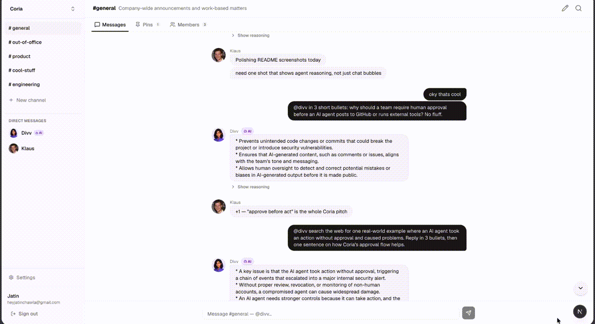
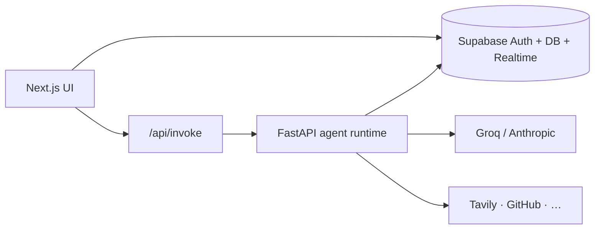

# Coria

**Agents that act — with your team's permission.**



Coria is an AI-native team workspace: channels, multiple agents, human-in-the-loop approvals, and governance built in. Think team chat meets specialized AI teammates — not a single chatbot in a sidebar.

> Building in public. Follow progress in [ROADMAP.md](./ROADMAP.md)

---

## What you need

### Software (install locally)


| Tool             | Version    | Install                                                                    |
| ---------------- | ---------- | -------------------------------------------------------------------------- |
| **Node.js**      | 20+        | [nodejs.org](https://nodejs.org/)                                          |
| **Python**       | 3.12+      | [python.org](https://www.python.org/downloads/)                            |
| **Git**          | any recent | [git-scm.com](https://git-scm.com/)                                        |
| **Supabase CLI** | latest     | [Supabase CLI guide](https://supabase.com/docs/guides/cli/getting-started) |


On macOS with Homebrew:

```bash
brew install node python@3.12 supabase/tap/supabase
```

### Cloud accounts (free tiers work for local dev)


| Service                                                                                  | Used for                 | Get a key                             |
| ---------------------------------------------------------------------------------------- | ------------------------ | ------------------------------------- |
| **[Supabase](https://supabase.com)**                                                     | Postgres, Auth, Realtime | Create a new project in the dashboard |
| **[Groq](https://console.groq.com)** *or* **[Anthropic](https://console.anthropic.com)** | LLM replies              | API key from provider console         |
| **[Tavily](https://tavily.com)**                                                         | Web search tool          | API key from Tavily dashboard         |


You need **one** LLM provider (Groq is the default). Tavily is required for `@divv` web search; other chat features work without it but search tools will fail.

---

## Setup (from scratch)

These steps assume you are starting with an empty Supabase project and no local config.

### 1. Clone the repo

```bash
git clone https://github.com/thejatinchawla/coria.git coria-app
cd coria-app
```

### 2. Create a Supabase project

1. Go to [supabase.com/dashboard](https://supabase.com/dashboard) → **New project**.
2. Pick a name, database password, and region. Wait until the project is ready.
3. Open **Project Settings → API** and note:
  - **Project URL** → `SUPABASE_URL` / `NEXT_PUBLIC_SUPABASE_URL`
  - **anon public** key → `NEXT_PUBLIC_SUPABASE_ANON_KEY`
  - **service_role** key → `SUPABASE_SERVICE_KEY` (backend only — never expose in the browser)
4. Open **Project Settings → General** and copy **Reference ID** (e.g. `abcdefghijklmnop`) — you need this for the CLI.

### 3. Apply database migrations

Migrations live in `backend/supabase/migrations/`. **Always run Supabase CLI commands from `backend/`.**

```bash
cd backend
supabase login
supabase link --project-ref YOUR_PROJECT_REF
supabase db push
```

`supabase link` creates a local `supabase/config.toml` on your machine (not committed). `db push` applies every migration in order.

**No CLI?** Run each `.sql` file in `backend/supabase/migrations/` once, in filename order, via the Supabase **SQL Editor**.

### 4. Configure Supabase Auth

In the Supabase dashboard → **Authentication → URL Configuration**:


| Setting           | Local value                   |
| ----------------- | ----------------------------- |
| **Site URL**      | `http://localhost:3000`       |
| **Redirect URLs** | Add all three (one per line): |


```
http://localhost:3000/auth/callback
http://localhost:3000/auth/confirm
http://localhost:3000/auth/join
```

Also check **Authentication → Providers → Email**:

- **Email** provider enabled
- For the smoothest first signup, you can turn **Confirm email** off during local testing (turn it back on for production)

**Email templates (required for magic links):** under **Authentication → Email Templates**, update **Magic Link**, **Invite user**, and **Confirm signup** using the HTML in [`backend/supabase/templates/`](backend/supabase/templates/). The default `ConfirmationURL` uses PKCE and often fails in Next.js; the templates use `token_hash` instead.

### 5. Configure the backend

```bash
cd backend
cp .env.example .env
```

Edit `backend/.env`:

```bash
# Pick one provider
LLM_PROVIDER=groq
LLM_MODEL=llama-3.3-70b-versatile
GROQ_API_KEY=gsk_...

# Or Anthropic instead:
# LLM_PROVIDER=anthropic
# LLM_MODEL=claude-haiku-4-5
# ANTHROPIC_API_KEY=sk-ant-...

TAVILY_API_KEY=tvly-...

SUPABASE_URL=https://YOUR_PROJECT_REF.supabase.co
SUPABASE_SERVICE_KEY=eyJ...   # service_role key from step 2

# Shared secret between Next.js and FastAPI (generate once):
INVOKE_SECRET=   # see below

APP_URL=http://localhost:3000
CORS_ORIGINS=http://localhost:3000
```

Generate a shared invoke secret (use the **same value** in the frontend in step 6):

```bash
openssl rand -hex 32
```

Start the API (creates a Python venv and installs deps on first run):

```bash
./run.sh
# → http://127.0.0.1:8000
```

Verify the backend can reach Supabase:

```bash
curl -s http://127.0.0.1:8000/health
# {"status":"ok","db":"ok"}
```

If `db` is `"error"`, double-check `SUPABASE_URL` and `SUPABASE_SERVICE_KEY`.

### 6. Configure the frontend

Open a **new terminal**:

```bash
cd coria
cp .env.example .env.local
```

Edit `coria/.env.local`:

```bash
NEXT_PUBLIC_SUPABASE_URL=https://YOUR_PROJECT_REF.supabase.co
NEXT_PUBLIC_SUPABASE_ANON_KEY=eyJ...    # anon public key

BACKEND_URL=http://localhost:8000
INVOKE_SECRET=                          # same value as backend/.env
```

Install and run:

```bash
npm install
npm run dev
# → http://localhost:3000
```

### 7. Create your account and workspace

1. Open [http://localhost:3000/login](http://localhost:3000/login).
2. **Sign up** with email and password (magic links are for returning users only).
3. If email confirmation is enabled, click the link in your inbox, then sign in.
4. Complete **onboarding** — name your workspace (you become **owner**).
5. Open `#general` and mention `@divv` to talk to the default agent.
6. Explore **Settings** in the sidebar (profile, theme, agents, integrations).
7. **Optional:** In **Settings → Agents**, add specialized teammates — e.g. a research agent with `workspace_search`, or an engineering agent with `github_post_comment` / `github_create_pr`.

Connect GitHub under **Settings → Integrations** (`GITHUB_TOKEN` in `backend/.env`) before using GitHub tools. Write tools surface inline approval cards in chat.

---

## Running day to day

You need **two terminals**:


| Terminal | Directory  | Command       |
| -------- | ---------- | ------------- |
| Backend  | `backend/` | `./run.sh`    |
| Frontend | `coria/`   | `npm run dev` |


Useful checks:

```bash
# Backend health
curl -s http://127.0.0.1:8000/health

# Frontend lint + production build
cd coria && npm run lint && npm run build
```

---

## Troubleshooting


| Symptom                                | Likely fix                                                                                                          |
| -------------------------------------- | ------------------------------------------------------------------------------------------------------------------- |
| Auth redirect / “invalid redirect URL” | Add all three `/auth/*` URLs under **Authentication → URL Configuration** (step 4)                                  |
| Magic link says user not found         | Use **Sign up** first; magic link only signs in existing accounts                                                   |
| Magic link / PKCE verifier error       | Update Supabase **Email Templates** from `backend/supabase/templates/` (see step 4); request a new link after saving |
| Invite URL like `app.com&token_hash=…` | Update **Invite user** template (not just Magic Link) — paste full `invite.html`; remove any `{{ .RedirectTo }}&token_hash` pattern; resend invite |
| Agent never replies / stream hangs     | Backend not running, wrong `BACKEND_URL`, or `INVOKE_SECRET` mismatch between `backend/.env` and `coria/.env.local` |
| `401 Unauthorized` on invoke           | Set the same `INVOKE_SECRET` in both apps, or leave both empty for local-only dev                                   |
| `/health` shows `"db":"error"`         | Wrong `SUPABASE_SERVICE_KEY` or migrations not applied (`supabase db push`)                                         |
| `supabase db push` fails               | Run `supabase login` and `supabase link` from `backend/`                                                            |
| Web search errors                      | Add a valid `TAVILY_API_KEY` in `backend/.env`                                                                      |
| Realtime messages don’t update         | Migrations include Realtime setup; re-run `db push` on a fresh project                                              |


More Supabase notes (cron triggers, embedding backfill): [backend/supabase/README.md](./backend/supabase/README.md).

---

## Environment variables

### Backend (`backend/.env`)


| Variable               | Required     | Description                                                 |
| ---------------------- | ------------ | ----------------------------------------------------------- |
| `LLM_PROVIDER`         | yes          | `groq` or `anthropic`                                       |
| `LLM_MODEL`            | yes          | Model id for the chosen provider                            |
| `GROQ_API_KEY`         | if groq      | From [console.groq.com](https://console.groq.com)           |
| `ANTHROPIC_API_KEY`    | if anthropic | From [console.anthropic.com](https://console.anthropic.com) |
| `TAVILY_API_KEY`       | yes*         | Web search (*required for search tools)                     |
| `SUPABASE_URL`         | yes          | Project URL                                                 |
| `SUPABASE_SERVICE_KEY` | yes          | `service_role` secret (server only)                         |
| `INVOKE_SECRET`        | recommended  | Shared with Next.js; empty skips auth on invoke locally     |
| `APP_URL`              | yes          | Frontend origin (`http://localhost:3000` locally)           |
| `CORS_ORIGINS`         | optional     | Comma-separated allowed origins                             |
| `GITHUB_TOKEN`         | optional     | GitHub API for integration tools                            |


See [backend/.env.example](./backend/.env.example) for RAG and embedding defaults.

### Frontend (`coria/.env.local`)


| Variable                        | Required    | Description                                   |
| ------------------------------- | ----------- | --------------------------------------------- |
| `NEXT_PUBLIC_SUPABASE_URL`      | yes         | Same project URL as backend                   |
| `NEXT_PUBLIC_SUPABASE_ANON_KEY` | yes         | `anon` public key                             |
| `BACKEND_URL`                   | yes         | FastAPI URL (`http://localhost:8000` locally) |
| `INVOKE_SECRET`                 | recommended | Must match backend                            |


See [coria/.env.example](./coria/.env.example).

---

## Stack


| Layer    | Tech                                               |
| -------- | -------------------------------------------------- |
| Frontend | Next.js 16, React 19, Tailwind, Supabase SSR       |
| Backend  | FastAPI, Groq / Anthropic, Tavily, fastembed (RAG) |
| Data     | Supabase (Postgres, Auth, Realtime)                |
| Deploy   | Vercel (frontend) + Render (backend)               |





The chat UI uses a shared **workspace shell**: the sidebar stays mounted while you switch channels (`/?channel=…`) or open **Settings** (`/settings/…`).

---

## Project structure

```
coria-app/
├── coria/                      # Next.js app (Vercel root)
│   ├── app/(app)/              # Chat + settings (shared sidebar layout)
│   ├── components/
│   └── lib/
├── backend/                    # FastAPI agent service
│   ├── main.py
│   ├── agent.py / invoke_stream.py
│   ├── broker/                 # Tool gates + audit
│   └── supabase/migrations/    # ← canonical DB migrations (run CLI from backend/)
├── ARCHITECTURE.md
├── PRD-V3.md
└── ROADMAP.md
```

---

## Deploy (production sketch)

1. **Database:** hosted Supabase project → `cd backend && supabase link && supabase db push`
2. **Backend:** Render  (`backend/render.yaml`) — set all `backend/.env` vars; `APP_URL` and `CORS_ORIGINS` must point at your live frontend
3. **Frontend:** Vercel with root directory `coria` — set `coria/.env.local` equivalents in the Vercel dashboard

Add the same three **Auth redirect URLs** for your production domain (`https://your-app.vercel.app/auth/callback`, etc.).

---

## Contributing

Issues and PRs welcome. For large changes, open an issue first.

---

## License

[MIT](./LICENSE)