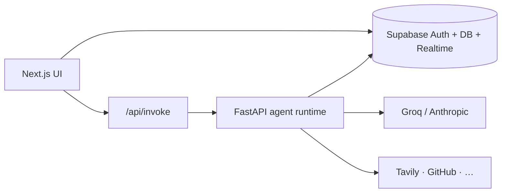

# Coria

**Agents that act — with your team's permission.**

Coria is an AI-native team workspace: channels, multiple agents, human-in-the-loop approvals, and governance built in. Think team chat meets specialized AI teammates — not a single chatbot in a sidebar.

> Building in public. Follow progress in [ROADMAP.md](./ROADMAP.md) and [docs/LINKEDIN_POST.md](./docs/LINKEDIN_POST.md).

---

## Why Coria

Most AI tools let agents call APIs and post externally without a clear approval step. Coria treats agents as **teammates with guardrails**:

- **Approve before act** — sensitive tool calls surface as inline action blocks (Approve / Decline)
- **Multiple agents** — `@divv` default; create more in Settings → Agents
- **Team-ready** — workspaces, channels, invites, owner/admin roles
- **Proactive agents** — cron digests and keyword triggers
- **Audit trail** — filterable log of agent actions

---

## Features


| Area             | What's shipped                                                             |
| ---------------- | -------------------------------------------------------------------------- |
| **Chat**         | Channels, threads, pins, streaming replies, reasoning traces               |
| **Agents**       | Multi-agent workspace, pause/kill switches, admin UI                       |
| **Trust**        | Action blocks, tool broker (permission → budget → rate → approval → audit) |
| **Memory**       | RAG over channel history + workspace memory tier                           |
| **Integrations** | GitHub read; write actions gated by approval                               |
| **Team admin**   | Invites, roles, workspace settings, member profiles                        |
| **Triggers**     | Cron schedules + keyword matchers                                          |
| **UX**           | Resizable sidebar, settings modal, custom confirm dialogs                  |


---

## Stack


| Layer    | Tech                                               |
| -------- | -------------------------------------------------- |
| Frontend | Next.js 16, React 19, Tailwind, Supabase SSR       |
| Backend  | FastAPI, Groq / Anthropic, Tavily, fastembed (RAG) |
| Data     | Supabase (Postgres, Auth, Realtime)                |
| Deploy   | Vercel (frontend) + Render/Railway (backend)       |


---

## Architecture




See [ARCHITECTURE-MVP.md](./ARCHITECTURE-MVP.md) for request flows and [PRD-V3.md](./PRD-V3.md) for product scope.

---

## Quick start (local)

### Prerequisites

- Node.js 20+
- Python 3.12+
- [Supabase CLI](https://supabase.com/docs/guides/cli)
- API keys: Supabase project, Groq or Anthropic, Tavily (web search)

### 1. Clone and configure Supabase

```bash
git clone https://github.com/YOUR_USERNAME/coria.git
cd coria-app

cd backend
supabase link --project-ref YOUR_PROJECT_REF
supabase db push
```

Migrations live in `backend/supabase/migrations/`.

### 2. Backend

```bash
cd backend
cp .env.example .env
# Fill in SUPABASE_URL, SUPABASE_SERVICE_KEY, GROQ_API_KEY (or ANTHROPIC), TAVILY_API_KEY, INVOKE_SECRET

./run.sh
# → http://127.0.0.1:8000
```

### 3. Frontend

```bash
cd coria
cp .env.example .env.local
# Fill in NEXT_PUBLIC_SUPABASE_* , BACKEND_URL, INVOKE_SECRET (same secret as backend)

npm install
npm run dev
# → http://localhost:3000
```

### 4. First run

1. Sign up at `/login`
2. Create a workspace on `/onboarding` (you become owner)
3. Open `#general`, mention `@divv` to chat with the default agent

Optional: connect GitHub in **Settings → Integrations**; test approval flow with `@divv` on write-capable tools.

---

## Project structure

```
coria-app/
├── coria/                 # Next.js app (Vercel root)
│   ├── app/               # Pages + API routes
│   ├── components/        # Chat, settings, UI
│   └── lib/               # Supabase, workspace helpers
├── backend/               # FastAPI agent service
│   ├── main.py
│   ├── agent.py / invoke_stream.py
│   ├── broker/            # Tool gates + audit
│   └── supabase/migrations/
├── ARCHITECTURE-MVP.md
├── PRD-V3.md
└── ROADMAP.md
```

---

## Environment variables


| App      | File               | Key vars                                                                                    |
| -------- | ------------------ | ------------------------------------------------------------------------------------------- |
| Backend  | `backend/.env`     | `SUPABASE_*`, `GROQ_API_KEY` or `ANTHROPIC_API_KEY`, `TAVILY_API_KEY`, `INVOKE_SECRET`      |
| Frontend | `coria/.env.local` | `NEXT_PUBLIC_SUPABASE_URL`, `NEXT_PUBLIC_SUPABASE_ANON_KEY`, `BACKEND_URL`, `INVOKE_SECRET` |


See `backend/.env.example` and `coria/.env.example` for full lists.

---

## Deploy

- **Frontend:** Vercel, root directory `coria`
- **Backend:** Render or Railway (`backend/render.yaml`, `backend/railway.toml`)
- **Database:** Supabase hosted project; run migrations via `supabase db push`

Set `APP_URL` and `CORS_ORIGINS` on the backend to your production frontend URL.

---

## Screenshots

Add a hero screenshot for README and social posts:

```bash
# Capture after local dev is running (see docs/SCREENSHOTS.md)
docs/screenshots/hero-chat.png
```

---

## Roadmap

Shipped vs planned: [ROADMAP.md](./ROADMAP.md)

**Not in V3:** SSO, billing, mobile apps, agent marketplace.

---

## Contributing

Issues and PRs welcome. For large changes, open an issue first 

---

## License

[MIT](./LICENSE)